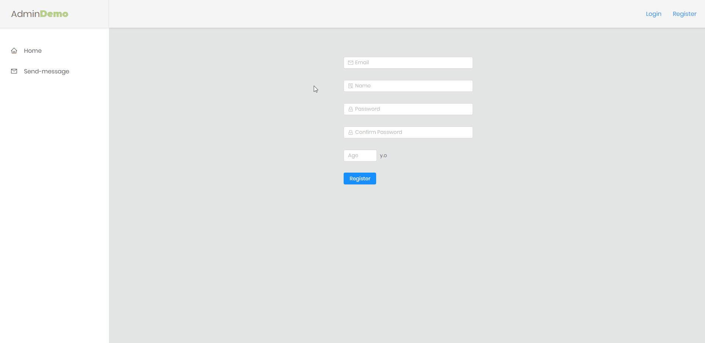
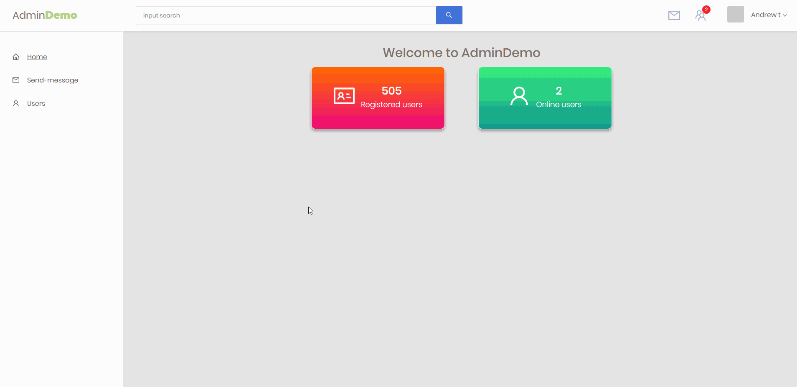
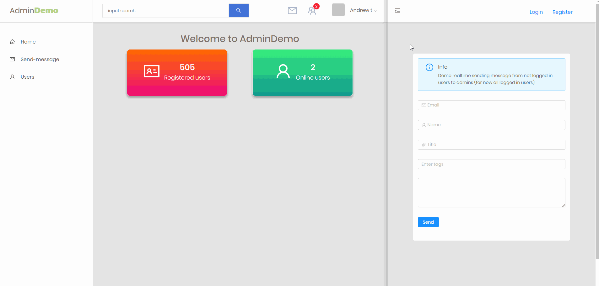
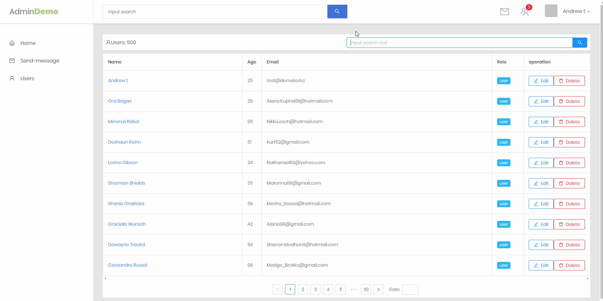

Live Demo - https://landing-admin.herokuapp.com

<h1>Admin-demo </h1>
<p align="center">

</p>

If you want run this app on your pc, first you must add variables to file `.env`. 

### For Cloudinary settings:
```bash
CLOUDINARY_API_KEY=
CLOUDINARY_API_SECRET=
CLOUDINARY_NAME=
```
About [Cloudinary](https://cloudinary.com/).

### For nodemailer settings:
```bash
EMAIL_USER=
EMAIL_PASS=
EMAIL_HOST=
```
About [Nodemailer](https://nodemailer.com).

### INSTALL NODE_MODULES:
```bash
$ yarn
```


### RUN ON PRODUCTION MODE:
```bash
$ yarn build
$ yarn start
```
Open http://localhost:4000 to view it in the browser.

### RUN ON DEVELOPMENT MODE:
```bash
$ yarn dev:react
```
Open another terminal
```bash
$ yarn dev:node
```
Open http://localhost:3000 to view it in the browser.

## FEATURES

- User authentication and email verification.


- Profile edit.


- Global search.


- Sending realtime messages with socket.io


- User data management.
